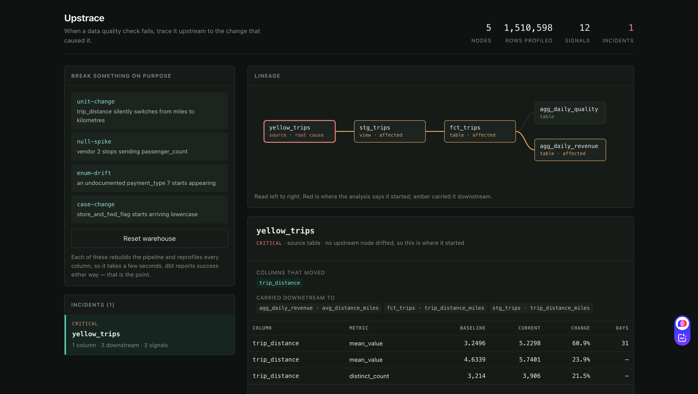
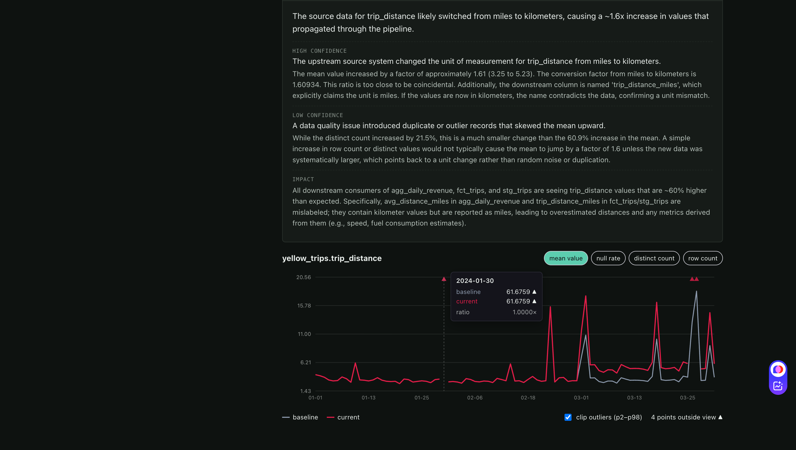

# Upstrace

[](https://github.com/ashg2099/upstrace/actions/workflows/nightly.yml)

When a data quality check fails, trace it upstream to the change that caused it.

Upstrace profiles every column of a dbt project on every run, compares each day
against its own history, walks the lineage graph to name the one node where a
problem started, and asks an LLM to explain it in a sentence a human can act on.



---

## Contents

- [The problem it exists for](#the-problem-it-exists-for)
- [How it works](#how-it-works)
- [Tech stack](#tech-stack)
- [Quick start — the demo, from zero](#quick-start--the-demo-from-zero)
- [Command reference](#command-reference)
- [Two ways to judge a value](#two-ways-to-judge-a-value)
- [What the metrics mean](#what-the-metrics-mean)
- [The dashboard](#the-dashboard)
- [Run it on your own dbt project](#run-it-on-your-own-dbt-project)
- [Configuration reference](#configuration-reference)
- [Slack alerts](#slack-alerts)
- [Environment variables](#environment-variables)
- [How well does it work](#how-well-does-it-work)
- [What it does not do](#what-it-does-not-do)
- [Repo layout](#repo-layout)

---

## The problem it exists for

A pipeline that crashes is not the expensive kind. The expensive kind is the one
that succeeds.

An upstream vendor starts sending `trip_distance` in kilometres instead of miles.
Nothing is null. Nothing violates a constraint. Every dbt test passes, every
model builds green, and the number flows into three downstream marts, a
dashboard, and whatever decision someone makes on Monday morning. The failure is
silent, and by the time anyone notices, the question is not *what broke* but
*where did this start* — a question usually answered by an analyst reading SQL
for two hours.

Upstrace answers that question mechanically.

## How it works

```
  dbt project
      │
      │  manifest.json  ────────────────┐
      ▼                                 │
  ┌────────────┐                        ▼
  │  profile   │  every column, whole-table AND per-day
  └─────┬──────┘  → upstrace_meta.column_profiles
        │           upstrace_meta.partition_profiles
        ▼
  ┌────────────┐
  │   drift    │  this run vs the previous run, per metric, per day
  └─────┬──────┘  → upstrace_meta.drift_signals
        │
        ▼
  ┌────────────┐
  │    rca     │  a node is a ROOT if it drifted and no ancestor drifted
  └─────┬──────┘  → incidents, each with evidence and blast radius
        │
        ▼
  ┌────────────┐
  │  explain   │  numbers + lineage → LLM → ranked hypothesis
  └────────────┘  (never the rows; cached by prompt hash)
```

Four steps, each doing one thing:

1. **Profile.** For every column in every dbt node, record row count, null rate,
   distinct count, min, max and mean — both for the table as a whole and **once
   per day**. The per-day part is the difference between working and not; see the
   numbers below.
2. **Detect drift.** Compare this run's profile to the previous one. A metric
   that moves more than its threshold becomes a signal, with severity scaled by
   how far past the threshold it went.
3. **Find the root.** Read the dbt `manifest.json`, build the lineage graph, and
   apply one rule: *a node is a root cause if it drifted and none of its upstream
   nodes drifted.* Everything downstream of a root is collateral.
4. **Explain.** Send the numbers and the lineage — never the rows — to an LLM and
   get back a ranked hypothesis with its reasoning and blast radius.

## Tech stack

| Layer                 | Choice                                                                         | Why                                                                                                              |
| --------------------- | ------------------------------------------------------------------------------ | ---------------------------------------------------------------------------------------------------------------- |
| Warehouse             | **DuckDB**                                                               | Single file on disk, no server, no cost. Analytical SQL fast enough to profile millions of rows in seconds       |
| Transformation        | **dbt** (`dbt-core` 1.10, `dbt-duckdb` 1.9)                          | The lineage graph comes free in`manifest.json` — that graph is what makes root-cause analysis possible at all |
| Profiling / detection | **Python 3.10+**, `duckdb`, `pandas`                                 | Profiles written as one`GROUP BY` per column, inserted in bulk from a DataFrame                                |
| CLI                   | **Typer** + **Rich**                                               | Subcommands,`--help`, formatted tables                                                                         |
| Config                | **PyYAML** (`upstrace.yml`)                                            | Nothing project-specific lives in Python                                                                         |
| API                   | **FastAPI** + **Uvicorn**                                          | One process serves JSON and the built SPA                                                                        |
| Dashboard             | **React 18** + **Vite**                                            | Hand-written SVG charts and lineage graph, no chart library                                                      |
| Alerting              | **Slack incoming webhooks** (stdlib `urllib`)                          | Root-cause summary in a channel, with no HTTP dependency added                                                   |
| LLM                   | **Groq** (`qwen/qwen3.8-27b`), with Gemini, Ollama and a mock provider | Free tier, structured JSON output, responses cached by prompt hash and committed                                 |
| Packaging             | **Hatchling**, **Docker** (two build targets)                      | `pip install -e .` or `docker build --target runtime`                                                        |
| Dataset               | **NYC TLC yellow taxi**, Jan–Mar 2024 (9.5M rows)                       | Public, messy, and has real date grain                                                                           |

Everything in this project runs on free tiers or on your own machine. There is no
paid dependency anywhere.

---

## Quick start — the demo, from zero

### Prerequisites

- Python 3.10 or newer
- Node 18 or newer (only for the dashboard)
- git
- About 1.5 GB of free disk for the full dataset

### 1. Clone and install

```bash
git clone https://github.com/ashg2099/upstrace
cd upstrace

python -m venv .venv
source .venv/bin/activate          # Windows: .venv\Scripts\activate

pip install -e .
pip install "dbt-core==1.10.*" "dbt-duckdb==1.9.*"
```

`pip install -e .` installs the package **and** puts the `upstrace` command on
your PATH. Check it:

```bash
upstrace --help
```

### 2. Add an API key (optional)

Only needed for `upstrace explain`. Everything else works without it.

```bash
cp .env.example .env
```

Open `.env` and paste a free [Groq](https://console.groq.com) key:

```
GROQ_API_KEY=gsk_...
UPSTRACE_LLM_PROVIDER=groq
UPSTRACE_LLM_MODEL=qwen/qwen3.8-27b
```

No key? Set `UPSTRACE_LLM_PROVIDER=mock`. The explanations already committed in
`cache/llm/` still replay, because responses are cached by prompt hash.

### 3. Get the data

```bash
python scripts/download_data.py
```

Downloads three months of NYC taxi parquet files (~150 MB) into `data/`. Want a
different range:

```bash
python scripts/download_data.py 2024-04 2024-05
```

### 4. Load it into DuckDB

```bash
python scripts/load_duckdb.py
```

Creates `warehouse/upstrace.duckdb` with `raw.yellow_trips` — 9,554,778 rows —
and prints a hand-written data quality report. That report is the manual work
Upstrace automates; it is worth reading once to see how dirty the data already
is before anything is injected.

### 5. Build the dbt models

```bash
cd transform
dbt run --profiles-dir .
dbt test --profiles-dir .
cd ..
```

This builds four nodes on top of the source:

```
yellow_trips (source) → stg_trips (view) → fct_trips (table) → agg_daily_revenue
                                                             → agg_daily_quality
```

`dbt run` also writes `transform/target/manifest.json`, which is where Upstrace
reads the lineage from. **Nothing works before this step.**

Two `dbt test` failures are expected — they are real problems in the raw data,
kept rather than filtered.

### 6. Take a baseline

```bash
upstrace models        # what Upstrace can see
upstrace profile       # baseline
upstrace profile       # current
upstrace drift         # should say: nothing moved
```

Drift always compares the **two most recent profile runs**, so you need at least
two. Two runs over unchanged data must produce zero signals — if they do not,
something is non-deterministic, which is exactly the bug the negative controls
later caught.

### 7. Break something on purpose

```bash
upstrace fault unit-change
```

`trip_distance` silently switches from miles to kilometres in the source, and the
whole pipeline is rebuilt. **dbt reports success.** That is the point.

```bash
upstrace profile
upstrace drift
upstrace rca
upstrace explain
```

What comes back:

```
yellow_trips   CRITICAL   source table
  no upstream node drifted, so this is where it started

  column          metric        baseline   current   change   days
  trip_distance   mean_value      3.2496    5.2298    60.9%     31
  trip_distance   mean_value      4.6339    5.7401    23.9%      -
  trip_distance   distinct_count   3,214     3,906    21.5%      -

  carried downstream to
    stg_trips.trip_distance_miles
    fct_trips.trip_distance_miles
    agg_daily_revenue.avg_distance_miles
```

Two rows for the same metric, and the difference between them is the whole
argument for per-partition profiling. The whole-table mean moved 23.9% —
suspicious, but not obviously anything. The per-day mean on the 31 affected days
moved **60.9%**, a ratio of 1.6094. The true miles-to-kilometres factor is
1.60934. Diluting a fault across 500,000 rows hides its signature; measuring each
day against itself preserves it.

### 8. Put it back

```bash
upstrace fault reset
```

### 9. What the model says

The LLM sees the evidence table and the lineage. It never sees a single row.



> **The source data for trip_distance likely switched from miles to kilometers,
> causing a ~1.6x increase in values that propagated through the pipeline.**
>
> **HIGH CONFIDENCE** — The upstream source system changed the unit of
> measurement for trip_distance from miles to kilometers. The mean value
> increased by a factor of approximately 1.61 (3.25 to 5.23). The conversion
> factor from miles to kilometers is 1.60934. This ratio is too close to be
> coincidental. Additionally, the downstream column is named
> `trip_distance_miles`, which explicitly claims the unit is miles. If the values
> are now in kilometers, the name contradicts the data, confirming a unit
> mismatch.
>
> **LOW CONFIDENCE** — A data quality issue introduced duplicate or outlier
> records that skewed the mean upward. While the distinct count increased by
> 21.5%, this is a much smaller change than the 60.9% increase in the mean. A
> simple increase in row count or distinct values would not typically cause the
> mean to jump by a factor of 1.6 unless the new data was systematically larger,
> which points back to a unit change rather than random noise or duplication.
>
> **IMPACT** — All downstream consumers of agg_daily_revenue, fct_trips, and
> stg_trips are seeing trip_distance values that are ~60% higher than expected.
> Specifically, avg_distance_miles in agg_daily_revenue and trip_distance_miles
> in fct_trips/stg_trips are mislabeled; they contain kilometer values but are
> reported as miles, leading to overestimated distances and any metrics derived
> from them (e.g., speed, fuel consumption estimates).

The column *name* used as evidence, and the explicit rejection of the alternative
hypothesis, are what make this worth more than a threshold alert.

---

## Command reference

Every command takes `--help`.

```
upstrace models     List the dbt models Upstrace can see, and what each depends on.
upstrace profile    Measure every column of every model and append to the metric history.
upstrace history    Show how one column's measurements have moved across runs.
upstrace fault      Break the raw data on purpose, or put it back.
upstrace drift      Compare the two most recent profile runs and report what moved.
upstrace rca        Turn the drift signals from the latest run into root causes.
upstrace explain    Ask a language model what the root-cause incidents actually mean.
upstrace eval       Inject every seeded defect in turn and score the root-cause analysis.
upstrace init       Write a starter upstrace.yml in the current directory.
upstrace config     Show the resolved configuration and where it came from.
upstrace report     Write a self-contained HTML report of the latest analysis.
upstrace slack-test Send a dummy message to confirm a Slack webhook works.
```

### `upstrace init` / `upstrace config`

```bash
upstrace init                 # writes upstrace.yml here
upstrace init --force         # overwrite an existing one
upstrace config               # what resolved, and which file it came from
```

`config` is the first thing to run when something looks wrong. If it prints
`(defaults, no upstrace.yml found)`, you are in the wrong directory —
configuration is discovered by walking up from the working directory, the way git
finds `.git`.

### `upstrace models`

Lists every node from the manifest with its dependencies. Empty output means the
manifest is missing (run `dbt run` first) or `include`/`exclude` filtered
everything out.

### `upstrace profile`

```bash
upstrace profile              # every included node
upstrace profile -m fct_trips # one model only
```

Writes one whole-table row per column and one row per column **per day** into
`upstrace_meta`. Prints the run id and how many profiles it wrote. Run it twice
before `drift` — comparison needs two runs.

### `upstrace history`

```bash
upstrace history -m yellow_trips -c trip_distance
```

Both flags are required. Shows how that one column's metrics have moved across
every recorded run — the CLI version of the dashboard's metric chart.

### `upstrace fault`

```bash
upstrace fault list                          # what can be injected
upstrace fault unit-change                   # inject, from 2024-03-01 onward
upstrace fault null-spike --since 2024-02-15 # inject from a different date
upstrace fault reset                         # put the raw data back
```

| Key             | What it simulates                                            |
| --------------- | ------------------------------------------------------------ |
| `unit-change` | `trip_distance` silently switches from miles to kilometres |
| `null-spike`  | vendor 2 stops sending`passenger_count`                    |
| `enum-drift`  | an undocumented`payment_type` 7 starts appearing           |
| `case-change` | `store_and_fwd_flag` starts arriving lowercase             |
| `reset`       | rebuild the pipeline from the untouched source               |

`--since` defaults to `2024-03-01`, so a fault touches the last 31 days of the
three-month dataset. That is where the `days 31` column in the evidence table
comes from — and shrinking the window is how the benchmark builds its
one-week and one-day scenarios, which are the hard ones.

Injection changes the raw table only — rebuild with dbt yourself afterwards, and
watch it report success either way. The dashboard's fault buttons rebuild and
reprofile in one step; the CLI leaves that to you so you can see dbt pass.

### `upstrace drift`

```bash
upstrace drift                        # report only
upstrace drift --baseline rolling     # override the configured baseline mode
upstrace drift --fail-on critical     # exit 1 if any critical signal
upstrace drift --fail-on warning      # exit 1 if anything at all moved
upstrace drift --slack-on warning     # also post to Slack
```

Compares the two most recent profile runs, writes signals to
`upstrace_meta.drift_signals`, and prints them worst-first. Two runs over
unchanged data must print *No drift above threshold*.

`--fail-on` is what makes this usable in CI. Without an exit code the job is
green whatever the tool found, and "monitoring" means someone remembering to
read logs.

It also warns when the two runs measured very different row volumes — comparing
a 500k-row sample against a 9.5M-row load makes every metric look like it moved,
and the tool would otherwise report that nonsense confidently.

`--slack-on` posts the run to Slack at or above a severity. It is independent of
`--fail-on`, and alerts are sent *before* the exit-code check — so a run that
fails CI still notifies. See [Slack alerts](#slack-alerts).

### `upstrace rca`

Groups the latest run's signals into incidents and names a root for each, using
one rule: a node is a root if it drifted and none of its upstream nodes drifted.
Prints the evidence and the downstream columns the change was carried into.

### `upstrace explain`

```bash
upstrace explain              # uses the cached response if the prompt matches
upstrace explain --no-cache   # force a fresh model call
```

Sends the evidence table and the lineage — never the rows — to the configured
LLM. Responses are cached on disk by prompt hash, so the same incident always
produces the same explanation and the committed cache replays without a key.

### `upstrace eval`

```bash
upstrace eval                                          # 56 scenarios + 4 controls
upstrace eval --limit 3                                # quick check
upstrace eval --sample 100000                          # faster, smaller baseline
upstrace eval --sample 500000 --report docs/eval-results.md
```

| Flag         | Default                  | Meaning                                                                                |
| ------------ | ------------------------ | -------------------------------------------------------------------------------------- |
| `--sample` | `500000`               | Rows to sample per run. The sample is seeded and`REPEATABLE`, so runs are comparable |
| `--limit`  | all                      | Run only the first N scenarios                                                         |
| `--report` | `docs/eval-results.md` | Where to write the markdown report                                                     |

A full run takes roughly 15 minutes at `--sample 500000`. It resets to a clean
baseline before every scenario, so it is safe to interrupt.

> `--report` overwrites its target. Commit the previous report before rerunning
> with a smaller `--limit` or `--sample`, or you will replace a full result with
> a partial one.

## Two ways to judge a value

A metric moved — compared to what? Upstrace supports two baselines.

**`previous_run`** (default) compares each partition against its own value in the
previous profile run. It is exact, needs no history, and catches a change the
moment it appears. It cannot see a fault that was already in place before you
started profiling — that value simply becomes "normal".

**`rolling`** compares each partition against a trailing window of its own
history using a median/MAD robust z-score, so one bad day does not move the bar.
A signal must clear both the statistical test and the configured practical
threshold, so a 0.4% move on a very stable column is not called an incident.

```yaml
baseline:
  mode: rolling             # or previous_run
  window: 28                # trailing partitions to compare against
  z: 3.5                    # robust z-score threshold
  min_history: 14           # skip a partition with less history than this
  min_partition_share: 0.2  # skip partitions far smaller than the window median
```

Or per run: `upstrace drift --baseline rolling`.

Rolling is **experimental**. On clean taxi data it surfaced real anomalies
nothing had planted — stray rows dated 2002, 2008, 2009 and 2023, a snowstorm on
2024-02-13, and a source-format change on 2024-02-15 — none of which
`previous_run` can structurally see. But it shares a weakness with every
trailing-window method: a fault in place for the whole window *becomes* the
baseline. Catching that needs changepoint detection over the full history,
tracked in [#1](../../issues/1).

## What the metrics mean

Six metrics are recorded per column, per run, and per day.

| Metric             | What it is                         | How change is measured                   | Default threshold |
| ------------------ | ---------------------------------- | ---------------------------------------- | ----------------- |
| `row_count`      | rows in the table (or in that day) | relative:`abs(new − old) / old`       | 2%                |
| `null_rate`      | fraction of values that are null   | **absolute**, in percentage points | 1 pp              |
| `distinct_count` | exact count of distinct values     | relative                                 | 10%               |
| `mean_value`     | average, numeric columns only      | relative                                 | 5%                |
| `min_value`      | smallest value, as text            | any change at all                        | —                |
| `max_value`      | largest value, as text             | any change at all                        | —                |

`null_rate` is absolute on purpose. A relative change from 0.001 to 0.002 is
100% and means nothing; a move from 0.1% to 1.1% is one percentage point and
means a vendor stopped sending a field.

`min_value` and `max_value` are reported with their actual values, not just as
"changed" — a move from `'casual'` to `'Casual'` is a diagnosis, while "changed"
is a shrug. They are the one place Upstrace handles real cell values rather than
metrics, so `profile.mask_values` withholds them for columns that should never
leave the warehouse.

`distinct_count` is counted **exactly**, and floats are rounded to six decimals
first. Both choices are explained in [determinism](#the-negative-controls-and-the-bug-they-found).

### Severity

A signal's severity comes from how far past its threshold it went:

| Severity     | Trigger                      |
| ------------ | ---------------------------- |
| `warning`  | at or past 1× the threshold |
| `high`     | at or past 2×               |
| `critical` | at or past 5×               |

Both the thresholds and these multipliers are configurable per node.

### Where it is all stored

Everything Upstrace records lives in a `upstrace_meta` schema inside the same
DuckDB file — so it is queryable with plain SQL:

| Table                  | Contents                                                                        |
| ---------------------- | ------------------------------------------------------------------------------- |
| `profile_runs`       | one row per run: id, start, end, node count                                     |
| `column_profiles`    | one row per column per run — whole-table metrics                               |
| `partition_profiles` | one row per column**per day** per run                                     |
| `drift_signals`      | every signal, with baseline, current, change, severity, and how many days moved |

```sql
-- what moved most in the latest run
SELECT model_name, column_name, metric, change, severity, partitions
FROM upstrace_meta.drift_signals
ORDER BY change DESC
LIMIT 10;
```

---

## The dashboard

### Development (two processes, hot reload)

```bash
# terminal 1 - API
uvicorn upstrace.api:app --reload --reload-dir src

# terminal 2 - SPA
cd app && npm install && npm run dev
```

Open the URL Vite prints (usually `http://localhost:5173`). It proxies `/api` to
port 8000.

### Single process

```bash
cd app && npm run build && cd ..
uvicorn upstrace.api:app --port 8000
```

FastAPI serves the built SPA from `app/static`. Open `http://localhost:8000`.
Interactive API docs at `/api/docs`.

### Four views

- **Incident feed and RCA detail** — every incident, its root node, the columns
  that moved, the evidence table, and where the change was carried downstream
- **Lineage graph** — read left to right; red is where the analysis says it
  started, amber is what carried it
- **Metric history** — per-day baseline and current overlaid, with metric tabs
  and a hover tooltip showing the ratio. The y-axis clips to p2–p98 and marks
  what falls outside; one freak day in the taxi data reaches 61.7 and would
  otherwise flatten the step change the chart exists to show
- **Fault panel** — inject a fault live and watch the incident appear

> **Demo order matters:** press **Reset warehouse** first, then inject. Resetting
> after injecting would show the repair itself as drift.

### API endpoints

| Method | Path                                                | Returns                                                 |
| ------ | --------------------------------------------------- | ------------------------------------------------------- |
| GET    | `/api/health`                                     | liveness                                                |
| GET    | `/api/overview`                                   | node count, rows profiled, signal count, incident count |
| GET    | `/api/lineage`                                    | nodes and edges, each flagged root / affected / clean   |
| GET    | `/api/incidents`                                  | every incident with its severity and summary            |
| GET    | `/api/incidents/{root}?explain=true`              | one incident, optionally with the LLM explanation       |
| GET    | `/api/metrics/{model}/{column}?metric=mean_value` | per-day baseline and current series                     |
| GET    | `/api/faults`                                     | the faults available to inject                          |
| POST   | `/api/faults/{key}`                               | inject a fault, rebuild, reprofile, re-analyse          |
| POST   | `/api/reset`                                      | restore the clean baseline                              |

---

## Run it on your own dbt project

The engine names no table and no dataset. It reads whatever dbt manifest you
point it at.

**Requirements:** a dbt project with a DuckDB target, and at least one date or
timestamp column on the tables you care about.

### 1. Install Upstrace

```bash
git clone https://github.com/ashg2099/upstrace
cd upstrace && pip install -e .
```

### 2. Build your own project once

Upstrace reads `target/manifest.json`, which only exists after a dbt build:

```bash
cd /path/to/your-dbt-project
dbt run
```

### 3. Create a config

```bash
upstrace init
```

This writes `upstrace.yml` in the current directory. Open it and set the two
paths that matter:

```yaml
project: my-project
warehouse: ./warehouse/analytics.duckdb   # your .duckdb file
dbt_project_dir: .                        # where dbt_project.yml lives
```

Both are resolved relative to `upstrace.yml` itself, so relative paths are fine.

### 4. Check what resolved

```bash
upstrace config
upstrace models
```

`upstrace config` prints which file it read and every resolved value. If it says
`(defaults, no upstrace.yml found)`, you are in the wrong directory —
configuration is discovered by walking up from the working directory, the way git
finds `.git`.

`upstrace models` should list your nodes. If it is empty, the manifest is missing
or `include`/`exclude` filtered everything out.

### 5. Profile twice, then look

```bash
upstrace profile      # baseline
# ... let real changes happen, or run your pipeline again ...
upstrace profile      # current
upstrace drift
upstrace rca
```

The first two runs over unchanged data should produce **zero** signals. If they
do not, something in your pipeline is non-deterministic — which is itself worth
knowing.

### 6. Tune it

Two things almost always need adjusting on a real project:

**Which models to profile.** Hundreds of models means slow runs and noise:

```yaml
profile:
  include: ["stg_*", "fct_*", "agg_*"]
  exclude: ["*_scratch", "stg_pii_*"]
```

**The partition axis.** Auto-detection picks the first `DATE` column, else the
first `TIMESTAMP`. That is right often, and silently wrong sometimes — a table
whose first date column is `customer_signup_date` would be profiled along an
axis that means nothing:

```yaml
profile:
  partition_column:
    fct_orders: order_date
    dim_customers: null      # null = skip per-day, whole-table only
```

Then re-run `upstrace profile` and check `days` in the drift output looks
sensible.

### 7. Thresholds

Start with the defaults. When a table alerts every day for no reason, override
it rather than raising the global number:

```yaml
thresholds:
  overrides:
    agg_marketing_events:
      row_count: 0.40      # this table genuinely swings 40% day to day
```

### With Docker instead

```bash
docker build --target runtime -t upstrace .
docker run -v "$PWD":/project -w /project -p 7860:7860 upstrace
```

The `runtime` target contains the tool and no data. The `demo` target — the
default if you build without `--target` — bakes in a 400,000-row sample and
builds its own warehouse, so `docker run -p 7860:7860 <image>` gives a working
demo with nothing to set up.

---

## Configuration reference

Every key in `upstrace.yml`, with its default:

```yaml
# Name shown by `upstrace config`. Cosmetic.
project: my-project

# Path to the DuckDB file. Relative paths resolve against this config file.
warehouse: warehouse/upstrace.duckdb

# Directory containing dbt_project.yml. The manifest is read from
# <dbt_project_dir>/target/manifest.json
dbt_project_dir: transform

# Where source parquet lives, for the demo scripts only.
data_dir: data

# Schema Upstrace writes its own tables into.
metrics_schema: upstrace_meta

profile:
  # Glob patterns matched against dbt node names. Exclude wins over include.
  include: ["*"]
  exclude: []

  # Per-day profiling axis.
  #   omitted  -> auto-detect (first DATE column, else first TIMESTAMP)
  #   a column -> use that column
  #   null     -> no per-day profiling for this node
  partition_column: {}

  # Refuse per-day profiling above this many distinct partitions. Guards against
  # a column that looks date-like but is effectively unique.
  max_partitions: 400
  # Columns whose min/max values must never leave the warehouse. min_value and
  # max_value are real cell values - the smallest value in an email column is a
  # real email address. Matched columns report <masked> instead.
  mask_values: []

thresholds:
  # Relative change, except null_rate which is absolute percentage points.
  default:
    row_count: 0.02
    null_rate: 0.01
    distinct_count: 0.10
    mean_value: 0.05

  # Per-node overrides, glob-matched, merged over the defaults.
  overrides: {}

baseline:
  # previous_run compares a partition to its own value in the last run.
  # rolling compares it to a trailing window of its own history.
  mode: previous_run
  window: 28
  z: 3.5
  min_history: 14
  min_partition_share: 0.2

# Multipliers of the threshold at which each severity begins.
severity:
  warning: 1.0
  high: 2.0
  critical: 5.0
```

## Slack alerts

Upstrace can post a run's incidents to a Slack channel.

1. Create an [incoming webhook](https://api.slack.com/messaging/webhooks) for the channel you want.
2. `export UPSTRACE_SLACK_WEBHOOK='https://hooks.slack.com/services/...'`
3. `upstrace slack-test` — confirms the webhook before you rely on it.

Then any drift run posts automatically:

```bash
upstrace drift --slack-on warning --report-url https://you.github.io/upstrace/
```

The message leads with the **root cause and its blast radius**, then the evidence
behind it — not a flat list of every correlated signal:

> 🔴 **Upstrace: 1 root cause, 15 signals**
>
> **Root cause** — `yellow_trips` (source) · `trip_distance` → 3 downstream:
> agg_daily_revenue, fct_trips, stg_trips

That distinction is the point. Fifteen alerts across four models read as four
problems; one root with a blast radius reads as one.

`--slack-on` takes `critical`, `high` or `warning`, and is independent of
`--fail-on`: CI can alert on warnings while only failing the build on criticals.
Alerts fire before the exit-code check, so a failing run still notifies.

The notifier uses only the standard library, so alerting adds no dependency.
`--report-url` adds an *Open report* button pointing at a published
`upstrace report` output.

This repo's own nightly workflow deliberately does **not** post to Slack: it
injects a fault every night on purpose, and a channel that cries wolf nightly is
the exact failure mode this tool exists to prevent.

### On a schedule

Upstrace has no scheduler — whatever runs your pipeline runs it. Add
`upstrace profile && upstrace drift --slack-on warning` after `dbt run` and
alerts arrive whenever that pipeline does.

A clean run posts nothing at all: the notifier returns without sending when no
signal meets the threshold. The channel stays quiet until something actually
moves, which is the only way an alert channel survives a month.

From cron, use a wrapper script and set everything explicitly — cron does not
load your shell profile, so a job that works in your terminal will silently do
nothing at 6am:

```bash
#!/usr/bin/env bash
set -euo pipefail
cd /srv/analytics && source .venv/bin/activate
export UPSTRACE_SLACK_WEBHOOK='https://hooks.slack.com/services/...'
dbt run && upstrace profile && upstrace drift --slack-on warning
```

In GitHub Actions, `schedule.cron` is UTC — 06:00 IST is `30 0 * * *`. In
Airflow, a `BashOperator` downstream of the dbt task: with `--fail-on critical`
the task turns red *and* the channel gets the root cause, from one command.

## Environment variables

Configuration lives in `upstrace.yml`; secrets and overrides live in the
environment (or `.env`, which is gitignored).

LLM responses are cached on disk under `cache/llm/`, keyed by a hash of the
prompt. The cache is committed, so every explanation in this repo reproduces
without a key. Change the prompt or the evidence and the hash changes, so a cache
hit always means the same question.

| Variable                     | Purpose                                                      |
| ---------------------------- | ------------------------------------------------------------ |
| `GROQ_API_KEY`             | API key for the Groq provider                                |
| `UPSTRACE_LLM_PROVIDER`    | `groq`, `gemini`, `ollama` or `mock`                 |
| `UPSTRACE_LLM_MODEL`       | model id, e.g.`qwen/qwen3.8-27b`                           |
| `UPSTRACE_CONFIG`          | path to a specific`upstrace.yml`, skipping discovery       |
| `UPSTRACE_WAREHOUSE`       | override the warehouse path                                  |
| `UPSTRACE_DBT_PROJECT_DIR` | override the dbt project path                                |
| `UPSTRACE_METRICS_SCHEMA`  | override the metadata schema name                            |
| `UPSTRACE_BASELINE_MODE`   | `previous_run` or `rolling`, overriding `upstrace.yml` |
| `UPSTRACE_SLACK_WEBHOOK`   | Slack incoming-webhook URL for alerts                        |
| `UPSTRACE_DEMO_SAMPLE`     | rows the dashboard's reset button loads (demo only)          |

---

## How well does it work

Claims about detection are cheap. This one is measured by a harness that injects
known faults and checks whether the reported root cause is the node that was
actually broken.

**56 fault scenarios** across four axes — fault type (unit change, fare
inflation, null spike, enum drift, row drop, case change, precision loss, flag
logic break, mart scaling), magnitude (small / medium / large), time window (one
day / one week / one month) and layer (source / model) — plus **4 negative
controls**.

|                             |                         |
| --------------------------- | ----------------------- |
| Drift detected              | **56 / 56**       |
| Correct root node           | **55 / 56**       |
| Correct column              | **55 / 56**       |
| Fully correct               | **55 / 56 (98%)** |
| False positives on controls | **0 / 4**         |

Full per-scenario output: [`docs/eval-results.md`](docs/eval-results.md).
Model comparison: [`docs/model-comparison.md`](docs/model-comparison.md).

### Verified on a second dataset

The benchmark above runs on the taxi data. To test the claim that the engine is
dataset-agnostic, it was pointed at a Citi Bike dbt project it had never seen —
different schema, different domain, a separate warehouse and config. It ran
first attempt, produced zero signals on two identical runs, and named the correct
root cause for an injected fault.

It also found a real bug that 56 taxi scenarios could not:
[`docs/second-dataset.md`](docs/second-dataset.md).

### Why per-partition profiling was necessary

The first working version profiled whole tables only. It scored 44/56, and every
single failure named a downstream aggregate rather than the source. The reason
was dilution: a fault confined to one day of ninety barely moves a table-wide
mean, but it moves a small aggregate table hard, so the aggregate looked like the
origin.

|                     | whole-table only | per-partition     |
| ------------------- | ---------------- | ----------------- |
| All scenarios       | 44 / 56          | **55 / 56** |
| One-day window only | 9 / 17           | **17 / 17** |

The one-day scenarios are the honest test — they are the ones a whole-table
average is designed to miss.

### The negative controls, and the bug they found

Four scenarios inject nothing, or something deliberately below threshold:

- `control-null` — the pipeline is rebuilt and reprofiled with **no change at all**
- `control-subthreshold-tip` — tips up 3%, under the 5% mean threshold
- `control-subthreshold-extra` — extras up 2%
- `control-subthreshold-tip-near-limit` — tips up 4.5%, just under the line

A control passes only if it raises no high or critical signal. When they were
added, `control-null` **failed**: three high-severity signals on a run where
nothing had changed.

The cause was real and worth writing down. Distinct counts were computed with
`approx_count_distinct`, a HyperLogLog estimate that varied by up to 30% between
identical runs. Compounding it, `sum()` and `avg()` run in parallel and
floating-point addition is not associative, so two mathematically equal groups
could differ in their last bits and change which values counted as distinct. The
fix was to count exactly, and to round floats first:

```python
def _distinct_expr(col: str, data_type: str) -> str:
    if _is_float(data_type):
        return f"count(distinct round({col}, 6))"
    return f"count(distinct {col})"
```

Two identical runs now produce **zero** signals. Fifty-six fault scenarios never
caught this; one negative control did — which is the argument for having them.

### The one that fails

`fare-inflation-small-day` — a 3% fare increase on a single day out of ninety.
Drift is detected, but the root is reported as `agg_daily_quality` rather than
`yellow_trips`. On that day the source column's own movement stayed just under
threshold while a downstream aggregate amplified it, so the rule that defines a
root — *drifted, with no drifted ancestor* — legitimately named the aggregate. It
is documented rather than tuned away, because moving the threshold to catch it
would cost false positives elsewhere.

### One more thing worth knowing

Partition profiles were originally inserted row by row with `executemany`: 8.2
seconds for 1,729 rows, growing with table size, and slow enough to time the
benchmark out. Building a DataFrame and running one
`INSERT INTO ... SELECT * FROM frame` brought it to 0.01 seconds.

---

## What it does not do

Stated plainly, because scope questions get asked:

- **dbt is required.** Lineage comes from `manifest.json`. Without it there is no
  basis for root-cause analysis, only alerts.
- **DuckDB only.** The profiler's SQL is DuckDB dialect. A Snowflake or BigQuery
  adapter would touch exactly one file, `profiler.py`, but that file has not been
  written.
- **Cannot detect a fault that predates its baseline.** `previous_run` compares
  against the last run and `rolling` against a trailing window, so a defect that
  was already there before either window began reads as normal. Changepoint
  detection over the full history is the fix, and is not built
- **No seasonality model.** `previous_run` uses fixed per-table thresholds;
  `rolling` uses a robust z-score but knows nothing about weekday/weekend or
  holiday effects, so it will flag a quiet Sunday on a weekday-shaped table.
- **No scheduler of its own.** Profiling runs when something runs it. The
  intended production shape is a step after `dbt run` in CI or Airflow — see
  [running it on a schedule](#on-a-schedule).[`.github/workflows/nightly.yml`](.github/workflows/nightly.yml) does exactly that against the demo data every night.

---

## Repo layout

```
src/upstrace/        the engine - names no table, no dataset
  settings.py        upstrace.yml: paths, globs, thresholds, partition axis
  config.py          resolved paths, a thin façade over settings
  warehouse.py       DuckDB connection and the upstrace_meta tables
  manifest.py        read dbt manifest.json into nodes and edges
  profiler.py        whole-table and per-partition column profiles
  drift.py           threshold comparison and severity
  notify.py          Slack notifications - stdlib only
  report.py          the self-contained HTML report
  lineage.py         ancestors / descendants over the dbt graph
  rca.py             the root-cause rule
  llm.py             providers (groq / gemini / ollama / mock) + prompt-hash cache
  explain.py         the prompt
  faults.py          fault injection - the evaluation fixture
  scenarios.py       56 faults + 4 negative controls
  evaluate.py        the harness and its scoring
  api.py             FastAPI: JSON API + SPA
  cli.py             every upstrace command

transform/           the demo dbt project - staging and marts over NYC taxi data
app/                 React + Vite dashboard
scripts/             data download, warehouse load, demo sample, Docker build
cache/llm/           committed LLM responses, keyed by prompt hash
docs/                eval results, model comparison, screenshots
upstrace.yml         configuration for the demo project
Dockerfile           two targets: runtime (tool only), demo (tool + data)
```

`transform/`, `faults.py` and `scenarios.py` are the demo pipeline and the
evaluation fixture. The engine never references them.

## Data

[NYC TLC yellow taxi trip records](https://www.nyc.gov/site/tlc/about/tlc-trip-record-data.page),
January–March 2024 — 9.5M rows. A 400,000-row reservoir sample spanning 91 days
is committed under `data/demo/` so the Docker image can build its own warehouse
without downloading anything.

## License

MIT
